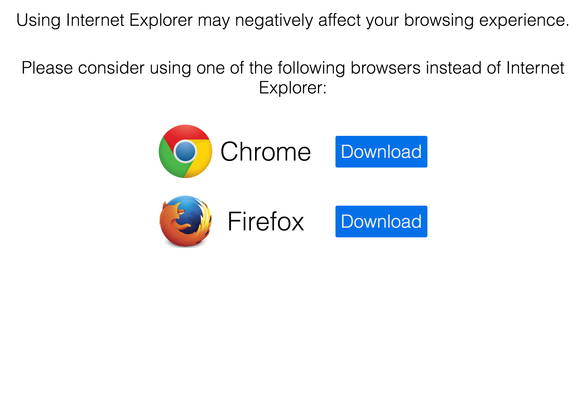

# \<no-ie\>

##Persuades the user to upgrade their browser in the most well-designed way possible.

###What this element will do

This element will be invisible unless Internet Explorer is [detected by a unique feature](http://stackoverflow.com/questions/9847580/how-to-detect-safari-chrome-ie-firefox-and-opera-browser#answer-9851769), upon which this element will appear and offer that the user download Google Chrome or Mozilla Firefox

###Preview

###How to use this element

Simply include the element anywhere on the page.  The element has `position: fixed` and has `visibility: hidden` as long as the user is not using Internet Explorer.  Only if the element detects Internet Explorer will it change the visibility to `visibility: visible` and offer the user download options.

###Notes

Pull requests are accepted.
